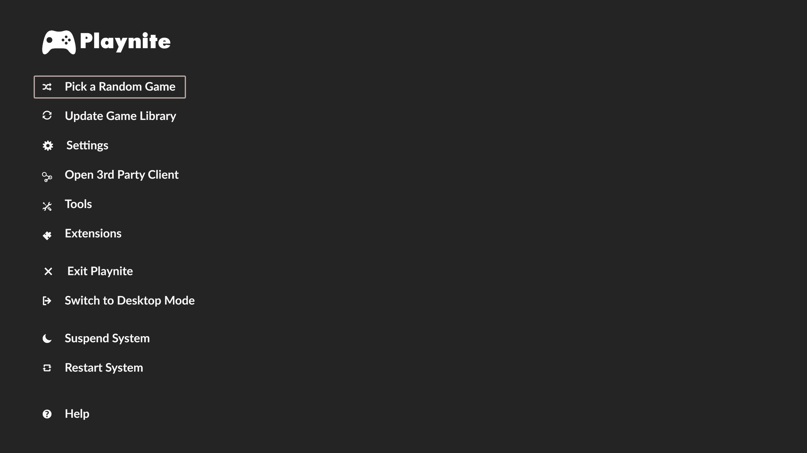

# Just reviving an abandoned theme. Most of this work is not mine!

# Credit should be attributed to ZeroAntix for his work on the original ReMix and Mike Aniki for his beautiful Icons used in this theme

[ZeroAntix's original theme on Github](https://github.com/zeroantix/ReMiX)

[Mike Aniki's main theme on GitHub](https://github.com/Mike-Aniki/Aniki-ReMake)

# Screenshots

 

# Changes Made

- Added support for Now Playing
- Reorganized menu bar items
- Prioritized horizontal scrolling
- New Icons (Thanks Mike!)
- Modernized for the latest versions of Playnite